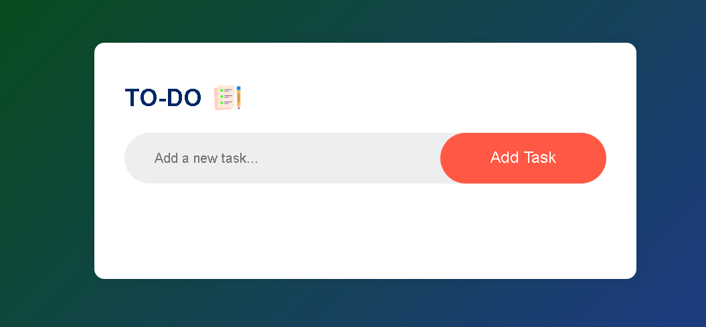
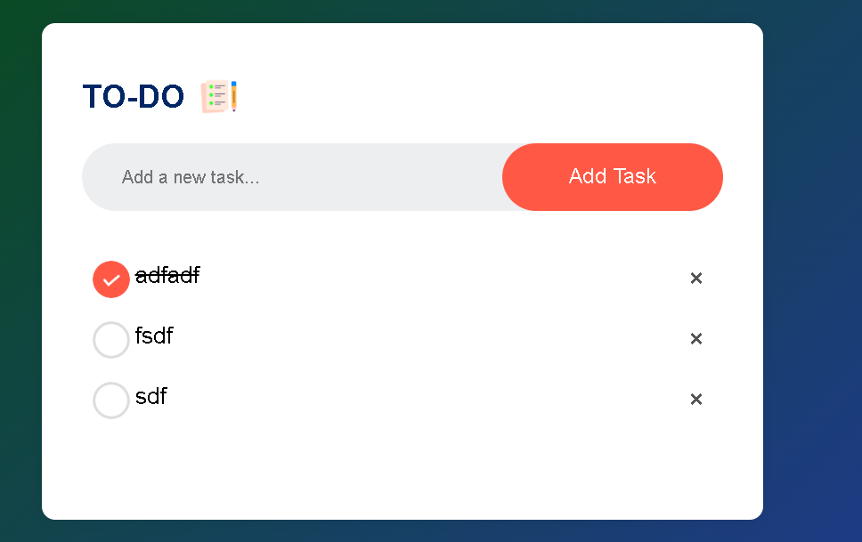

# TO-DO List Web App

A simple and interactive To-Do List web application built with HTML, CSS, and JavaScript. This app allows users to add, check off, and remove tasks, with data persistence using the browser's localStorage.

## Features
- Add new tasks to your to-do list
- Mark tasks as completed by clicking on them
- Remove tasks by clicking the delete (×) button
- Tasks are saved in your browser and persist after refresh

## How to Use
1. Open `index.html` in your web browser.
2. Enter a task in the input box and press Enter or click the add button (if available).
3. Click on a task to mark it as completed.
4. Click the × icon next to a task to delete it.

## Project Structure
```
index.html        # Main HTML file
style.css         # Styles for the app
script.js         # JavaScript logic
images/           # Icons and images used in the app
```

## Screenshots



## Credits
- Developed by Raju
- Icons from the `images/` folder

## License
This project is for personal and educational use.
